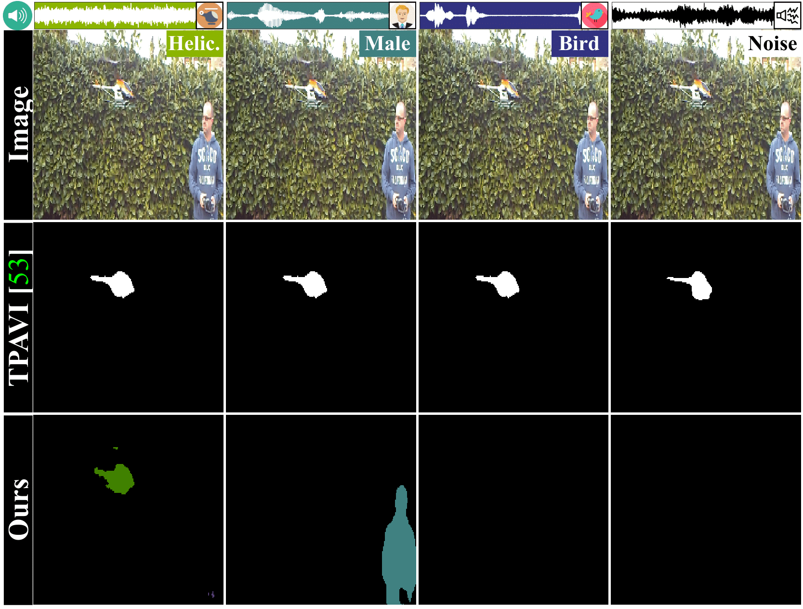
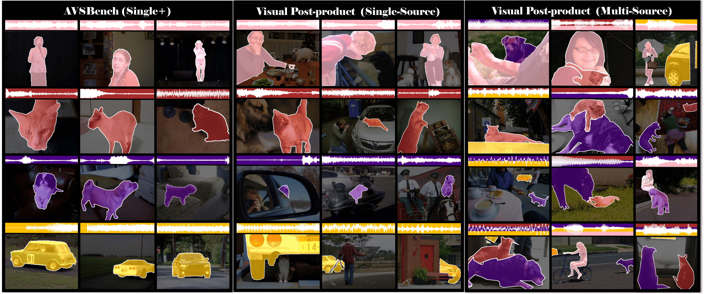
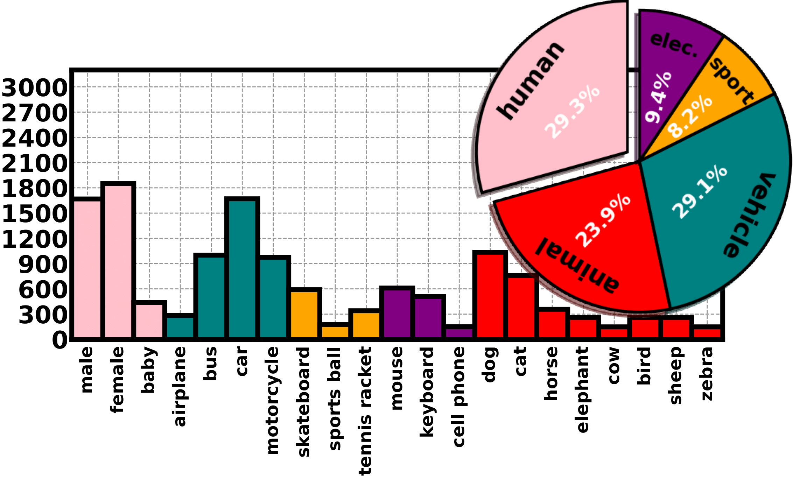
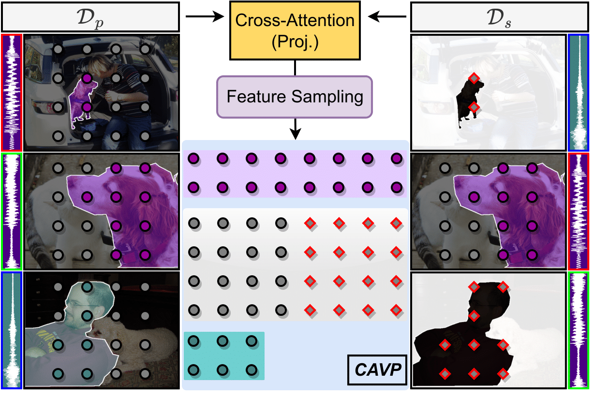

# A Closer Look at Audio-Visual Semantic Segmentation
Official code for "A Closer Look at Audio-Visual Semantic Segmentation"


> **A Closer Look at Audio-Visual Semantic Segmentation**,<br />
> [Yuanhong Chen*](https://scholar.google.com/citations?user=PiWKAx0AAAAJ&hl=en&oi=ao), [Yuyuan Liu](https://scholar.google.com/citations?user=SibDXFQAAAAJ&hl=zh-CN), [Hu Wang](https://huwang01.github.io/), [Fengbei Liu*](https://fbladl.github.io/), [Chong Wang](https://scholar.google.com/citations?user=IWcTej4AAAAJ&hl=en&oi=ao), [Gustavo Carneiro](https://www.surrey.ac.uk/people/gustavo-carneiro).            
> *([arXiv 2203.01937](https://arxiv.org/abs/2203.01937))*


<figure>
    
    <figcaption>The TPAVI AVS model tends to be biased to segment specific objects in a scene due to limitations in the training set and in the training process.</figcaption>
</figure>


## Dataset
### AVSBench-Single+
Datasets are available here [`AVSBench-Single+`]()*

### Visual Post-production (VPO)
We build AVS datasets based on pairs of audio-visual data are obtained by matching images and audio based on the semantic classes
of the visual objects of the images and audio based on the semantic classes of the visual objects of the images. We leverage labelled image data from **COCO**, and audio source from **VGGSound**. Please note that we are excluding images containing multiple instances of the same class in the dataset due to the absence of spatial information from VGGSound.

*VPO datasets are available here [`VPO-SS`](https://drive.google.com/file/d/1gMIoWFDyXXknH7SxniggVxPTyugEnhjl/view?usp=drive_link)*
[`VPO-MS`](https://drive.google.com/file/d/1Qk_SDqWuUzUQ5KZjOBk9wy7_L4y24qqF/view?usp=drive_link)*


*Visual comparison between datasets. We show four audio-visual classes, including “female”, “cat”, “dog”, and “car”. The AVSBench-Single+ (left column) provides pixel-level multi-class annotations to the images containing a single-sounding object. The proposed VPO benchmarks (center and right columns) pair a subset of the segmented objects in an
image with relevant audio files to produce pixel-level multi-class annotations.*

<figure>
    
    <figcaption>Data distribution of VPO.</figcaption>
</figure>


## Method
### Contrastive Audio-visual Pairing
<figure>
    
    <figcaption>Illustration of our contrastive learning method based on the original (left column) and shuffled (right column) audio-visual pairs.</figcaption>
</figure>

## Results

### Results on VPO-SS/MS
| Backbone    | Architecture |       | SS |       |       |MS |        |
|-------------|--------------|-------|---------------------|-------|-------|--------------------|--------|
|             |              | FDR   | mIoU                | F1    | FDR   | mIoU               | F1     |
| D-ResNet50  | TPAVI        | 30.64 | 42.44               | 55.22 | 30.82 | 44.08              | 58.14  |
| D-ResNet50  | DeepLabV3+   | 20.41 | 61.21               | 73.29 | 18.64 | 59.58              | 72.46  |
| D-ResNet101 | DeepLabV3+   | 19.47 | 66.26               | 77.34 | 15.72 | 62.91              | 75.41  |
| HRNetV2-w48 | HRNetV2      | 21.64 | 64.42               | 75.27 | 20.86 | 64.18              | 76.49  |
| HRNetV2-w48 | OCR          | 18.49 | 66.38               | 77.45 | 16.58 | 65.62              | 77.29  |

### Results on AVSBench-Single+
| AVS Benchmark    | Metrics  | TPAVI    | Ours     |
|------------------|----------|----------|----------|
| AVSBench-Salient | mIoU     | 72.79    | 83.06    |
|                  | F-Beta   | 84.80    | 90.39    |
| AVSBench-Single+ | FDR      | 18.54    | 12.71    |
|                  | mIoU     | 66.98    | 74.17    |
|                  | F1       | 79.61    | 84.86    |
| # Parameters     | Size     | 163.55 M | 119.78 M |

### Results on AVSBench-Semantics
| Metrics          | mIoU  | F-Score |
|------------------|-------|---------|
| TPAVI (ResNet50) | 20.18 | 25.20   |
| TPAVI (PVT)      | 29.77 | 35.20   |
| Ours             | 39.78 | 50.67   |


## Citation
```
@article{chen2023closer,
  title={A Closer Look at Audio-Visual Semantic Segmentation},
  author={Chen, Yuanhong and Liu, Yuyuan and Wang, Hu and Liu, Fengbei and Wang, Chong and Carneiro, Gustavo},
  journal={arXiv e-prints},
  pages={arXiv--2304},
  year={2023}
}
```
